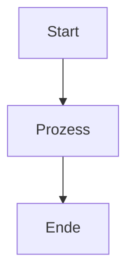

# MarkFlow Lite

> Ein reiner Front-End Online-Markdown-Editor

[](https://opensource.org/licenses/MIT)

<p align="center">
  <a href="README.md">中文</a> •
  <a href="README_en.md">English</a> •
  <a href="README_ja.md">日本語</a> •
  <a href="README_es.md">Español</a> •
  <a href="README_pt.md">Português</a>
</p>

MarkFlow Lite ist ein reiner Front-End-Markdown-Editor, der vollständig im Browser läuft, keinen Server benötigt und sofort einsatzbereit ist, mit Unterstützung für Echtzeit-Bearbeitung, Doppelsicht-Vorschau, lokales Speichern und Inhaltsfreigabe.

## 🌟 Funktionen

- ✍️ **Echtzeit-Bearbeitung** - Unterstützt Standard-Markdown-Syntax (einschließlich Tabellen, Codeblöcke, Listen, etc.)
- 👁️ **Echtzeit-Vorschau** - Schreiben und sehen gleichzeitig, unterstützt mathematische Formeln und Flussdiagramm-Darstellung
- 💾 **Lokaler Speicher** - Speichert automatisch Entwürfe im lokalen Browserspeicher
- 📄 **Dateiexport** - Unterstützt Export in PDF-, HTML- und Markdown-Formate
- 📂 **Dateiverwaltung** - Unterstützt Erstellung neuer Dokumente und Öffnen lokaler Markdown-Dateien
- 🔗 **Inhaltsfreigabe** - Generiert eindeutige Links, Inhalte können über URL-Parameter geteilt werden
- 🎨 **Designwechsel** - Bietet dunkles/helles Design, angepasst an verschiedene Lesenumgebungen
- ⌨️ **Tastenkombinationen** - Unterstützt gängige Tastenkombinationen (Fett, Kursiv, Titel einfügen, etc.)
- 📱 **Responsives Design** - Unterstützt Desktop, Tablet und mobile Zugriffe

## 🚀 Schnellstart

### Online-Nutzung

Besuchen Sie direkt [MarkFlow Lite](https://editor.currso.com), um mit der Nutzung zu beginnen.

### Lokale Entwicklung

```bash
# Projekt klonen
git clone https://github.com/blankzsh/markflow-lite.git

# In das Projektverzeichnis wechseln
cd markflow-lite

# Abhängigkeiten installieren
npm install

# Entwicklungsserver starten
npm run dev

# Für Produktion erstellen
npm run build

# Produktions-Build voranzeigen
npm run preview
```

## 🛠️ Technologie-Stack

- **Entwicklungs-Framework**: React + TypeScript + Vite
- **Markdown-Parsing**: markdown-it
- **Code-Highlighting**: Highlight.js
- **Styling**: Tailwind CSS + @tailwindcss/typography
- **Mathematische Formeln**: MathJax (über markdown-it-mathjax3)
- **Flussdiagramm-Unterstützung**: Mermaid
- **Build-Tool**: Vite
- **Deployment-Plattformen**: GitHub Pages / Vercel / Netlify

## 📖 Nutzungshandbuch

### Grundlegende Operationen

1. **Bearbeitungsmodus** - Markdown-Inhalt im linken Bearbeitungsbereich schreiben
2. **Vorschaumodus** - Gerendertes Ergebnis in Echtzeit anzeigen
3. **Geteilter Modus** - Bearbeitungs- und Vorschaubereich gleichzeitig anzeigen

### Tastenkombinationen

- `Ctrl + B` - Fett
- `Ctrl + I` - Kursiv
- `Ctrl + K` - Link einfügen

### Cloud-Speicher-Integration

MarkFlow Lite unterstützt mehrere Cloud-Speicher-Backends:

1. **AWS S3** - Verbindung zu S3-Speicher-Buckets für Dateiverwaltung
2. **WebDAV** - Verbindung zu jedem WebDAV-fähigen Server
3. **Lokaler Speicher** - Browser-lokaler Speicher (Standard)

Über den Datei-Explorer können Sie:
- Cloud-Speicherdienste verbinden und trennen
- Remote-Ordnerstrukturen durchsuchen
- Remote-Dateien erstellen, bearbeiten und löschen
- Lokale und Remote-Dateien synchronisieren

### Unterstützte Syntax

- Überschriften (#, ##, ###, ...)
- Textstile (fett, kursiv, durchgestrichen)
- Listen (nummeriert, aufzählend, Aufgabenlisten)
- Links und Bilder
- Codeblöcke und Inline-Code
- Zitatblöcke
- Tabellen
- Horizontale Linien
- Mathematische Formeln (LaTeX)
- Flussdiagramme (Mermaid)

### Mermaid-Flussdiagramm-Nutzung

Unterstützt mehrere Mermaid-Diagrammtypen:

```markdown

```

Unterstützte Diagrammtypen:
- Flussdiagramme (Flowchart)
- Sequenzdiagramme (Sequence Diagram)
- Gantt-Diagramme (Gantt Diagram)
- Klassendiagramme (Class Diagram)
- Zustandsdiagramme (State Diagram)

## 📤 Exportfunktionen

- **PDF-Export** - Dokumente in PDF-Format exportieren
- **HTML-Export** - In eigenständige HTML-Dateien exportieren
- **Markdown-Export** - Original-Markdown-Dateien exportieren

## 🐛 Behobene Probleme

### Kürzlich behobene Probleme

- Problem mit zu großer Flussdiagramm-Darstellung behoben, Diagrammgrößen-Kontrolle optimiert
- Problem gelöst, dass Codeblöcke von Tabellen verdeckt wurden
- Große Leerzeichen am unteren Seitenrand nach Flussdiagramm-Darstellung behoben
- Anzeigereihenfolge aller Inhalte auf derselben Ebene optimiert

## 🔧 Bereitstellung

### Auf Vercel bereitstellen

```bash
npm run build
vercel --prod
```

### Auf Netlify bereitstellen

```bash
npm run build
# dist-Verzeichnis auf Netlify hochladen
```

### Auf GitHub Pages bereitstellen

```bash
npm run build
# dist-Verzeichnis auf gh-pages-Branch pushen
```

## 🤝 Beitrag

Willkommen, Issues und Pull Requests zu erstellen, um MarkFlow Lite zu verbessern.

### Entwicklungsprozess

1. Projekt forken
2. Feature-Branch erstellen (`git checkout -b feature/AmazingFeature`)
3. Änderungen committen (`git commit -m 'Add some AmazingFeature'`)
4. Auf Branch pushen (`git push origin feature/AmazingFeature`)
5. Pull Request öffnen

## 📄 Lizenz

Dieses Projekt ist unter der MIT-Lizenz lizenziert - siehe [LICENSE](LICENSE)-Datei für Details

## 🙏 Danksagungen

- [markdown-it](https://github.com/markdown-it/markdown-it) - Markdown-Parser
- [Highlight.js](https://highlightjs.org/) - Code-Syntax-Highlighting
- [Tailwind CSS](https://tailwindcss.com/) - CSS-Framework
- [MathJax](https://www.mathjax.org/) - Mathematische Formeln-Darstellung
- [Mermaid](https://mermaid-js.github.io/) - Flussdiagramm-Darstellung
- [Vite](https://vitejs.dev/) - Front-End-Build-Tool

## 📞 Kontakt

Projekt-URL: [https://github.com/blankzsh/markflow-lite](https://github.com/blankzsh/markflow-lite)

Bei Fragen oder Vorschlägen senden Sie bitte ein Issue oder kontaktieren Sie den Projektbetreuer.