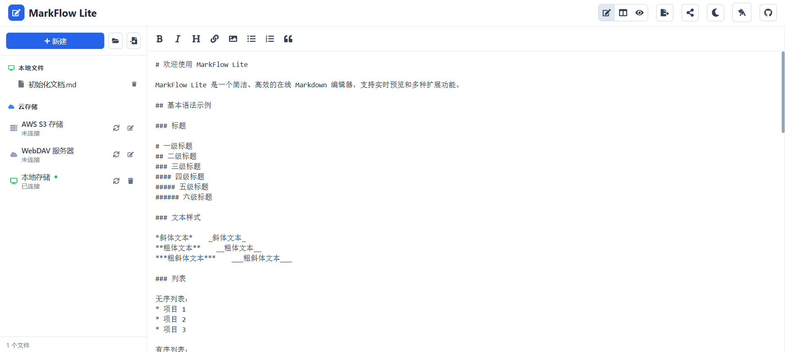
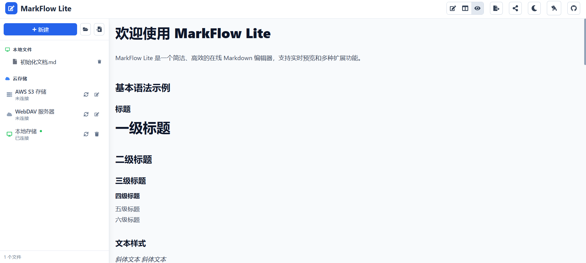
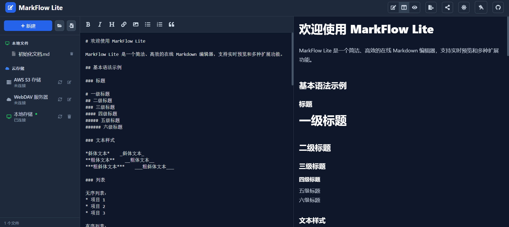
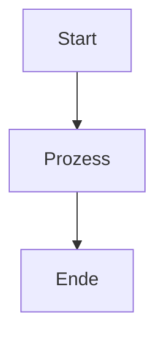

# MarkFlow Lite

> Ein reiner Frontend-online-Markdown-Editor

[](https://opensource.org/licenses/MIT)
[](https://github.com/blankzsh/markflow-lite/commits/main)
[](https://github.com/blankzsh/markflow-lite/issues)
[](https://github.com/blankzsh/markflow-lite/pulls)
[](https://github.com/blankzsh/markflow-lite/stargazers)
[](https://github.com/blankzsh/markflow-lite/network/members)

<p align="center">
  <a href="README.md">中文</a> •
  <a href="README_en.md">English</a> •
  <a href="README_ja.md">日本語</a> •
  <a href="README_es.md">Español</a> •
  <a href="README_pt.md">Português</a>
</p>

MarkFlow Lite ist ein reiner Frontend-Markdown-Editor, der vollständig im Browser läuft, keinen Server-Support benötigt und sofort einsatzbereit ist, mit Unterstützung für Echtzeit-Bearbeitung, Doppelvorschau, lokales Speichern und Inhaltsfreigabe.

## 🌟 Funktionen

- ✍️ **Echtzeit-Bearbeitung** - Unterstützt standard Markdown-Syntax (einschließlich Tabellen, Codeblöcke, Listen, etc.)
- 👁️ **Echtzeit-Vorschau** - Sehen Sie beim Schreiben, unterstützt mathematische Formeln und Flussdiagramm-Rendering
- 💾 **Lokaler Speicher** - Speichert automatisch Entwürfe im lokalen Browserspeicher
- 📄 **Dateiexport** - Unterstützt Export in PDF-, HTML-, Markdown-Formate
- 📂 **Dateiverwaltung** - Unterstützt das Erstellen neuer Dokumente, Öffnen lokaler Markdown-Dateien
- 🔗 **Inhaltsfreigabe** - Generiert eindeutige Links, Inhalte können über URL-Parameter geteilt werden
- 🎨 **Theme-Wechsel** - Bietet dunkle/helle Themes, angepasst an verschiedene Lesenumgebungen
- ⌨️ **Tastenkombinationen** - Unterstützt gängige Tastenkombinationen (Fett, Kursiv, Titel einfügen, etc.)
- 📱 **Responsives Design** - Unterstützt Desktop-, Tablet- und Mobilzugriff

## 📸 Oberflächenvorschau

<div align="center">
  
  <p><em>MarkFlow Lite Editor-Oberfläche - Echtzeit-Bearbeitung und Vorschaufunktion</em></p>
</div>

<div align="center">
  
  <p><em>MarkFlow Lite Vorschau-Oberfläche - Unterstützt mathematische Formeln und Flussdiagramm-Rendering</em></p>
</div>

<div align="center">
  
  <p><em>MarkFlow Lite Dunkles Theme - Komfortable Nachbearbeitungserfahrung</em></p>
</div>

## 🚀 Schnellstart

[](https://nodejs.org/)
[](https://www.npmjs.com/)

### Online-Nutzung

Besuchen Sie [MarkFlow Lite](https://editor.currso.com) direkt, um mit der Nutzung zu beginnen.

### Lokale Entwicklung

```bash
# Klonen Sie das Projekt
git clone https://github.com/blankzsh/markflow-lite.git

# Wechseln Sie in das Projektverzeichnis
cd markflow-lite

# Installieren Sie die Abhängigkeiten
npm install

# Starten Sie den Entwicklungsserver
npm run dev

# Erstellen Sie für die Produktion
npm run build

# Vorschau der Produktionsversion
npm run preview
```

## 🛠️ Technologie-Stack

[](https://reactjs.org/)
[](https://www.typescriptlang.org/)
[](https://vitejs.dev/)
[](https://tailwindcss.com/)
[](https://markdown-it.github.io/)

- **Entwicklungs-Framework**: React + TypeScript + Vite
- **Markdown-Parsing**: markdown-it
- **Code-Hervorhebung**: Highlight.js
- **Stil-Design**: Tailwind CSS + @tailwindcss/typography
- **Mathematische Formeln**: MathJax (über markdown-it-mathjax3)
- **Flussdiagramm-Unterstützung**: Mermaid
- **Build-Tool**: Vite
- **Bereitstellungsplattformen**: GitHub Pages / Vercel / Netlify

## 📖 Verwendungsanleitung

### Grundlegende Operationen

1. **Bearbeitungsmodus** - Schreiben Sie Markdown-Inhalte im linken Bearbeitungsbereich
2. **Vorschaumodus** - Zeigen Sie den gerenderten Effekt in Echtzeit an
3. **Geteilter Modus** - Zeigen Sie beide Bereiche (Bearbeitung und Vorschau) gleichzeitig an

### Tastenkombinationen

- `Ctrl + B` - Fett
- `Ctrl + I` - Kursiv
- `Ctrl + K` - Link einfügen

### Cloud-Speicher-Integration

MarkFlow Lite unterstützt mehrere Cloud-Speicher-Backends:

1. **AWS S3** - Verbinden Sie sich mit S3-Speicher-Buckets für die Dateiverwaltung
2. **WebDAV** - Verbinden Sie sich mit jedem WebDAV-fähigen Server
3. **Lokaler Speicher** - Browser-lokaler Speicher (Standard)

Über den Datei-Explorer können Sie:
- Cloud-Speicherdienste verbinden und trennen
- Remote-Ordnerstrukturen durchsuchen
- Remote-Dateien erstellen, bearbeiten und löschen
- Lokale und Remote-Dateien synchronisieren

### Unterstützte Syntax

- Überschriften (#, ##, ###, ...)
- Textstile (fett, kursiv, durchgestrichen)
- Listen (geordnet, ungeordnet, Aufgabenlisten)
- Links und Bilder
- Codeblöcke und Inline-Code
- Zitate
- Tabellen
- Horizontale Linien
- Mathematische Formeln (LaTeX)
- Flussdiagramme (Mermaid)

### Verwendung von Mermaid-Flussdiagrammen

Unterstützt mehrere Mermaid-Diagrammtypen:

```markdown

```

Unterstützte Diagrammtypen:
- Flussdiagramme (Flowchart)
- Sequenzdiagramme (Sequence Diagram)
- Gantt-Diagramme (Gantt Diagram)
- Klassendiagramme (Class Diagram)
- Zustandsdiagramme (State Diagram)

## 📤 Exportfunktionen

- **PDF-Export** - Exportieren Sie Dokumente in das PDF-Format
- **HTML-Export** - Exportieren Sie in eigenständige HTML-Dateien
- **Markdown-Export** - Exportieren Sie originale Markdown-Dateien

## 🐛 Behobene Probleme

### Kürzlich behobene Probleme

- Behoben: Flussdiagramm-Rendering zu groß, optimierte Diagrammgrößenkontrolle
- Gelöst: Das Problem, dass Codeblöcke von Tabellen verdeckt wurden
- Behoben: Große Leerzeichen am unteren Rand der Seite nach Flussdiagramm-Rendering
- Optimierte korrekte Anzeigereihenfolge aller Inhalte auf derselben Ebene
- Entfernte PWA-Funktionalität und verwandte Konfigurationen, behobene Build-Probleme

## 🔧 Bereitstellung

### Bereitstellung auf Vercel

[](https://vercel.com/)

```bash
npm run build
vercel --prod
```

### Bereitstellung auf Netlify

[](https://www.netlify.com/)

```bash
npm run build
# Laden Sie das dist-Verzeichnis auf Netlify hoch
```

### Bereitstellung auf GitHub Pages

[](https://pages.github.com/)

```bash
npm run build
# Pushen Sie das dist-Verzeichnis auf den gh-pages-Branch
```

## 🤝 Beitrag

Willkommen bei der Einreichung von Issues und Pull Requests zur Verbesserung von MarkFlow Lite.

### Entwicklungsprozess

1. Forken Sie das Projekt
2. Erstellen Sie einen Feature-Branch (`git checkout -b feature/AmazingFeature`)
3. Committen Sie Änderungen (`git commit -m 'Add some AmazingFeature'`)
4. Pushen Sie zum Branch (`git push origin feature/AmazingFeature`)
5. Öffnen Sie einen Pull Request

## 📄 Lizenz

Dieses Projekt ist unter der MIT-Lizenz lizenziert - siehe [LICENSE](LICENSE)-Datei für Details

## 🙏 Danksagungen

- [markdown-it](https://github.com/markdown-it/markdown-it) - Markdown-Parser
- [Highlight.js](https://highlightjs.org/) - Code-Syntax-Hervorhebung
- [Tailwind CSS](https://tailwindcss.com/) - CSS-Framework
- [MathJax](https://www.mathjax.org/) - Mathematische Formel-Rendering
- [Mermaid](https://mermaid-js.github.io/) - Flussdiagramm-Rendering
- [Vite](https://vitejs.dev/) - Frontend-Build-Tool

## 📞 Kontakt

Projekt-URL: [https://github.com/blankzsh/markflow-lite](https://github.com/blankzsh/markflow-lite)

**E-Mail-Feedback**: [shell7@petalmail.com](mailto:shell7@petalmail.com)

Wenn Sie Fragen oder Vorschläge haben, reichen Sie bitte ein Issue ein oder kontaktieren Sie den Projektbetreuer per E-Mail. Wir schätzen das Feedback jedes Benutzers!