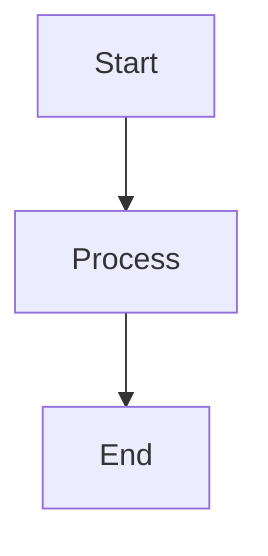

# MarkFlow Lite

> A pure front-end online Markdown editor

[](https://opensource.org/licenses/MIT)
[](https://github.com/blankzsh/markflow-lite/commits/main)
[](https://github.com/blankzsh/markflow-lite/issues)
[](https://github.com/blankzsh/markflow-lite/pulls)
[](https://github.com/blankzsh/markflow-lite/stargazers)
[](https://github.com/blankzsh/markflow-lite/network/members)

<p align="center">
  <a href="README.md">中文</a> •
  <a href="README_ja.md">日本語</a> •
  <a href="README_es.md">Español</a> •
  <a href="README_pt.md">Português</a> •
  <a href="README_de.md">Deutsch</a>
</p>

MarkFlow Lite is a pure front-end Markdown editor that runs entirely in the browser, requiring no server support and ready to use out of the box, supporting real-time editing, dual preview, local saving, and content sharing.

## 🌟 Features

- ✍️ **Real-time Editing** - Supports standard Markdown syntax (including tables, code blocks, lists, etc.)
- 👁️ **Real-time Preview** - See as you write, supports mathematical formulas and flowchart rendering
- 💾 **Local Storage** - Automatically saves drafts to browser local storage
- 📄 **File Export** - Supports export to PDF, HTML, Markdown formats
- 📂 **File Management** - Supports creating new documents, opening local Markdown files
- 🔗 **Content Sharing** - Generate unique links, content can be shared via URL parameters
- 🎨 **Theme Switching** - Provides dark/light themes, adapted to different reading environments
- ⌨️ **Shortcut Operations** - Supports common shortcuts (bold, italic, title insertion, etc.)
- 📱 **Responsive Design** - Supports desktop, tablet, and mobile access

## 🚀 Quick Start

[](https://nodejs.org/)
[](https://www.npmjs.com/)

### Online Use

Visit [MarkFlow Lite](https://editor.currso.com) directly to start using it.

### Local Development

```bash
# Clone the project
git clone https://github.com/blankzsh/markflow-lite.git

# Enter the project directory
cd markflow-lite

# Install dependencies
npm install

# Start the development server
npm run dev

# Build for production
npm run build

# Preview the production build
npm run preview
```

## 🛠️ Tech Stack

[](https://reactjs.org/)
[](https://www.typescriptlang.org/)
[](https://vitejs.dev/)
[](https://tailwindcss.com/)
[](https://markdown-it.github.io/)

- **Development Framework**: React + TypeScript + Vite
- **Markdown Parsing**: markdown-it
- **Code Highlighting**: Highlight.js
- **Style Design**: Tailwind CSS + @tailwindcss/typography
- **Mathematical Formulas**: MathJax (via markdown-it-mathjax3)
- **Flowchart Support**: Mermaid
- **Build Tool**: Vite
- **Deployment Platforms**: GitHub Pages / Vercel / Netlify

## 📖 Usage Guide

### Basic Operations

1. **Edit Mode** - Write Markdown content in the left editing area
2. **Preview Mode** - View the rendered effect in real-time
3. **Split Mode** - View both editing and preview areas simultaneously

### Shortcuts

- `Ctrl + B` - Bold
- `Ctrl + I` - Italic
- `Ctrl + K` - Insert link

### Cloud Storage Integration

MarkFlow Lite supports multiple cloud storage backends:

1. **AWS S3** - Connect to S3 storage buckets for file management
2. **WebDAV** - Connect to any WebDAV-enabled server
3. **Local Storage** - Browser local storage (default)

Through the file explorer, you can:
- Connect and disconnect cloud storage services
- Browse remote folder structures
- Create, edit, and delete remote files
- Sync local and remote files

### Supported Syntax

- Headers (#, ##, ###, ...)
- Text styles (bold, italic, strikethrough)
- Lists (ordered, unordered, task lists)
- Links and images
- Code blocks and inline code
- Blockquotes
- Tables
- Horizontal rules
- Mathematical formulas (LaTeX)
- Flowcharts (Mermaid)

### Mermaid Flowchart Usage

Supports multiple Mermaid chart types:

```markdown

```

Supported chart types:
- Flowcharts (Flowchart)
- Sequence Diagrams (Sequence Diagram)
- Gantt Diagrams (Gantt Diagram)
- Class Diagrams (Class Diagram)
- State Diagrams (State Diagram)

## 📤 Export Functions

- **PDF Export** - Export documents to PDF format
- **HTML Export** - Export to standalone HTML files
- **Markdown Export** - Export original Markdown files

## 🐛 Fixed Issues

### Recently Fixed Issues

- Fixed flowchart rendering being too large, optimized chart size control
- Solved the issue of code blocks being obscured by tables
- Fixed large blank spaces appearing at the bottom of the page after flowchart rendering
- Optimized the correct display order of all content on the same layer
- Removed PWA functionality and related configurations, resolved build issues

## 🔧 Deployment

### Deploy to Vercel

[](https://vercel.com/)

```bash
npm run build
vercel --prod
```

### Deploy to Netlify

[](https://www.netlify.com/)

```bash
npm run build
# Upload dist directory to Netlify
```

### Deploy to GitHub Pages

[](https://pages.github.com/)

```bash
npm run build
# Push dist directory to gh-pages branch
```

## 🤝 Contribution

Welcome to submit Issues and Pull Requests to help improve MarkFlow Lite.

### Development Process

1. Fork the project
2. Create a feature branch (`git checkout -b feature/AmazingFeature`)
3. Commit changes (`git commit -m 'Add some AmazingFeature'`)
4. Push to branch (`git push origin feature/AmazingFeature`)
5. Open a Pull Request

## 📄 License

This project is licensed under the MIT License - see [LICENSE](LICENSE) file for details

## 🙏 Acknowledgements

- [markdown-it](https://github.com/markdown-it/markdown-it) - Markdown parser
- [Highlight.js](https://highlightjs.org/) - Code syntax highlighting
- [Tailwind CSS](https://tailwindcss.com/) - CSS framework
- [MathJax](https://www.mathjax.org/) - Mathematical formula rendering
- [Mermaid](https://mermaid-js.github.io/) - Flowchart rendering
- [Vite](https://vitejs.dev/) - Frontend build tool

## 📞 Contact

Project URL: [https://github.com/blankzsh/markflow-lite](https://github.com/blankzsh/markflow-lite)

**Email Feedback**: [shell7@petalmail.com](mailto:shell7@petalmail.com)

If you have any questions or suggestions, please submit an Issue or contact the project maintainer via email. We value every user's feedback!