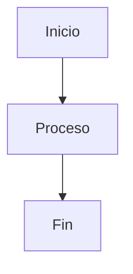

# MarkFlow Lite

> Un editor Markdown en línea de front-end puro

[](https://opensource.org/licenses/MIT)

<p align="center">
  <a href="README.md">中文</a> •
  <a href="README_en.md">English</a> •
  <a href="README_ja.md">日本語</a> •
  <a href="README_pt.md">Português</a> •
  <a href="README_de.md">Deutsch</a>
</p>

MarkFlow Lite es un editor Markdown de front-end puro que se ejecuta completamente en el navegador, sin necesidad de servidor y listo para usar, con soporte para edición en tiempo real, vista previa dual, guardado local y compartición de contenido.

## 🌟 Características

- ✍️ **Edición en tiempo real** - Soporta sintaxis Markdown estándar (incluyendo tablas, bloques de código, listas, etc.)
- 👁️ **Vista previa en tiempo real** - Ve mientras escribes, con soporte para fórmulas matemáticas y renderizado de diagramas de flujo
- 💾 **Almacenamiento local** - Guarda automáticamente borradores en el almacenamiento local del navegador
- 📄 **Exportación de archivos** - Soporta exportación a formatos PDF, HTML, Markdown
- 📂 **Gestión de archivos** - Soporta creación de nuevos documentos y apertura de archivos Markdown locales
- 🔗 **Compartición de contenido** - Genera enlaces únicos, el contenido se puede compartir mediante parámetros URL
- 🎨 **Cambio de tema** - Proporciona temas oscuro/claro, adaptado a diferentes entornos de lectura
- ⌨️ **Operaciones de atajo** - Soporta atajos comunes (negrita, cursiva, inserción de título, etc.)
- 📱 **Diseño responsivo** - Soporta escritorio, tableta y acceso móvil

## 🚀 Inicio rápido

### Uso en línea

Visita [MarkFlow Lite](https://editor.currso.com) directamente para comenzar a usarlo.

### Desarrollo local

```bash
# Clonar el proyecto
git clone https://github.com/blankzsh/markflow-lite.git

# Entrar al directorio del proyecto
cd markflow-lite

# Instalar dependencias
npm install

# Iniciar el servidor de desarrollo
npm run dev

# Construir para producción
npm run build

# Previsualizar la construcción de producción
npm run preview
```

## 🛠️ Pila tecnológica

- **Framework de desarrollo**: React + TypeScript + Vite
- **Análisis de Markdown**: markdown-it
- **Resaltado de código**: Highlight.js
- **Diseño de estilo**: Tailwind CSS + @tailwindcss/typography
- **Fórmulas matemáticas**: MathJax (mediante markdown-it-mathjax3)
- **Soporte de diagramas de flujo**: Mermaid
- **Herramienta de construcción**: Vite
- **Plataformas de despliegue**: GitHub Pages / Vercel / Netlify

## 📖 Guía de uso

### Operaciones básicas

1. **Modo de edición** - Escribe contenido Markdown en el área de edición izquierda
2. **Modo de vista previa** - Ve el efecto renderizado en tiempo real
3. **Modo dividido** - Ve ambas áreas de edición y vista previa simultáneamente

### Atajos

- `Ctrl + B` - Negrita
- `Ctrl + I` - Cursiva
- `Ctrl + K` - Insertar enlace

### Integración de almacenamiento en la nube

MarkFlow Lite soporta múltiples backends de almacenamiento en la nube:

1. **AWS S3** - Conecta a buckets de almacenamiento S3 para gestión de archivos
2. **WebDAV** - Conecta a cualquier servidor habilitado para WebDAV
3. **Almacenamiento local** - Almacenamiento local del navegador (por defecto)

A través del explorador de archivos, puedes:
- Conectar y desconectar servicios de almacenamiento en la nube
- Navegar estructuras de carpetas remotas
- Crear, editar y eliminar archivos remotos
- Sincronizar archivos locales y remotos

### Sintaxis soportada

- Encabezados (#, ##, ###, ...)
- Estilos de texto (negrita, cursiva, tachado)
- Listas (ordenadas, desordenadas, listas de tareas)
- Enlaces e imágenes
- Bloques de código y código en línea
- Citas en bloque
- Tablas
- Reglas horizontales
- Fórmulas matemáticas (LaTeX)
- Diagramas de flujo (Mermaid)

### Uso de diagramas de flujo Mermaid

Soporta múltiples tipos de diagramas Mermaid:

```markdown

```

Tipos de diagramas soportados:
- Diagramas de flujo (Flowchart)
- Diagramas de secuencia (Sequence Diagram)
- Diagramas de Gantt (Gantt Diagram)
- Diagramas de clase (Class Diagram)
- Diagramas de estado (State Diagram)

## 📤 Funciones de exportación

- **Exportación PDF** - Exporta documentos al formato PDF
- **Exportación HTML** - Exporta a archivos HTML independientes
- **Exportación Markdown** - Exporta archivos Markdown originales

## 🐛 Problemas corregidos

### Problemas recientemente corregidos

- Corregido el problema de renderizado de diagramas demasiado grandes, optimizado el control de tamaño de gráficos
- Resuelto el problema de bloques de código siendo oscurecidos por tablas
- Corregido grandes espacios en blanco que aparecían en la parte inferior de la página después del renderizado de diagramas
- Optimizado el orden de visualización correcto de todo el contenido en la misma capa

## 🔧 Despliegue

### Desplegar en Vercel

```bash
npm run build
vercel --prod
```

### Desplegar en Netlify

```bash
npm run build
# Subir directorio dist a Netlify
```

### Desplegar en GitHub Pages

```bash
npm run build
# Empujar directorio dist a la rama gh-pages
```

## 🤝 Contribución

Bienvenido a enviar Issues y Pull Requests para ayudar a mejorar MarkFlow Lite.

### Proceso de desarrollo

1. Hacer fork del proyecto
2. Crear una rama de función (`git checkout -b feature/AmazingFeature`)
3. Confirmar cambios (`git commit -m 'Add some AmazingFeature'`)
4. Empujar a la rama (`git push origin feature/AmazingFeature`)
5. Abrir una Pull Request

## 📄 Licencia

Este proyecto está licenciado bajo la Licencia MIT - ver archivo [LICENSE](LICENSE) para detalles

## 🙏 Agradecimientos

- [markdown-it](https://github.com/markdown-it/markdown-it) - Analizador de Markdown
- [Highlight.js](https://highlightjs.org/) - Resaltado de sintaxis de código
- [Tailwind CSS](https://tailwindcss.com/) - Framework CSS
- [MathJax](https://www.mathjax.org/) - Renderizado de fórmulas matemáticas
- [Mermaid](https://mermaid-js.github.io/) - Renderizado de diagramas de flujo
- [Vite](https://vitejs.dev/) - Herramienta de construcción front-end

## 📞 Contacto

URL del proyecto: [https://github.com/blankzsh/markflow-lite](https://github.com/blankzsh/markflow-lite)

Si tienes preguntas o sugerencias, por favor envía un Issue o contacta al mantenedor del proyecto.