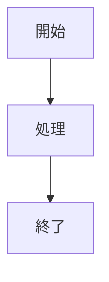

# MarkFlow Lite

> 純粋なフロントエンドのオンラインMarkdownエディター

[](https://opensource.org/licenses/MIT)

<p align="center">
  <a href="README.md">中文</a> •
  <a href="README_en.md">English</a> •
  <a href="README_es.md">Español</a> •
  <a href="README_pt.md">Português</a> •
  <a href="README_de.md">Deutsch</a>
</p>

MarkFlow Liteは、ブラウザ内で完全に動作する純粋なフロントエンドのMarkdownエディターで、サーバーを必要とせず、すぐに使用できるリアルタイム編集、二重プレビュー、ローカル保存、コンテンツ共有をサポートしています。

## 🌟 特徴

- ✍️ **リアルタイム編集** - 標準のMarkdown構文をサポート（テーブル、コードブロック、リストなどを含む）
- 👁️ **リアルタイムプレビュー** - 書きながら見る、数式とフローチャートのレンダリングをサポート
- 💾 **ローカルストレージ** - ブラウザのローカルストレージに下書きを自動保存
- 📄 **ファイルエクスポート** - PDF、HTML、Markdown形式へのエクスポートをサポート
- 📂 **ファイル管理** - 新規ドキュメント作成、ローカルMarkdownファイルのオープンをサポート
- 🔗 **コンテンツ共有** - 固有のリンクを生成、URLパラメータでコンテンツを共有可能
- 🎨 **テーマ切り替え** - ダーク/ライトテーマを提供、異なる読書環境に適応
- ⌨️ **ショートカット操作** - 一般的なショートカットをサポート（太字、斜体、タイトル挿入など）
- 📱 **レスポンシブデザイン** - デスクトップ、タブレット、モバイル端末をサポート

## 🚀 クイックスタート

### オンライン使用

[MarkFlow Lite](https://editor.currso.com)に直接アクセスして使用開始。

### ローカル開発

```bash
# プロジェクトをクローン
git clone https://github.com/blankzsh/markflow-lite.git

# プロジェクトディレクトリに入る
cd markflow-lite

# 依存関係をインストール
npm install

# 開発サーバーを起動
npm run dev

# 本番用にビルド
npm run build

# 本番ビルドをプレビュー
npm run preview
```

## 🛠️ 技術スタック

- **開発フレームワーク**: React + TypeScript + Vite
- **Markdown解析**: markdown-it
- **コードハイライト**: Highlight.js
- **スタイル設計**: Tailwind CSS + @tailwindcss/typography
- **数式**: MathJax (markdown-it-mathjax3経由)
- **フローチャートサポート**: Mermaid
- **ビルドツール**: Vite
- **デプロイメントプラットフォーム**: GitHub Pages / Vercel / Netlify

## 📖 使用ガイド

### 基本操作

1. **編集モード** - 左側の編集エリアでMarkdownコンテンツを記述
2. **プレビューモード** - レンダリング結果をリアルタイムで確認
3. **分割モード** - 編集エリアとプレビューエリアを同時に表示

### ショートカット

- `Ctrl + B` - 太字
- `Ctrl + I` - 斜体
- `Ctrl + K` - リンク挿入

### クラウドストレージ統合

MarkFlow Liteは複数のクラウドストレージバックエンドをサポート：

1. **AWS S3** - S3ストレージバケットに接続してファイル管理
2. **WebDAV** - WebDAV対応サーバーに接続
3. **ローカルストレージ** - ブラウザのローカルストレージ（デフォルト）

ファイルエクスプローラーを通じて以下の操作が可能：
- クラウドストレージサービスの接続と切断
- リモートフォルダ構造の閲覧
- リモートファイルの作成、編集、削除
- ローカルとリモートファイルの同期

### サポートされる構文

- 見出し (#, ##, ###, ...)
- テキストスタイル（太字、斜体、打ち消し線）
- リスト（番号付き、箇条書き、タスクリスト）
- リンクと画像
- コードブロックとインラインコード
- 引用ブロック
- テーブル
- 水平線
- 数式（LaTeX）
- フローチャート（Mermaid）

### Mermaidフローチャート使用方法

複数のMermaidチャートタイプをサポート：

```markdown

```

サポートされるチャートタイプ：
- フローチャート（Flowchart）
- シーケンス図（Sequence Diagram）
- ガント図（Gantt Diagram）
- クラス図（Class Diagram）
- 状態図（State Diagram）

## 📤 エクスポート機能

- **PDFエクスポート** - ドキュメントをPDF形式でエクスポート
- **HTMLエクスポート** - 独立したHTMLファイルとしてエクスポート
- **Markdownエクスポート** - 元のMarkdownファイルをエクスポート

## 🐛 修正された問題

### 最近修正された問題

- フローチャートのレンダリングが大きすぎる問題を修正、チャートサイズ制御を最適化
- コードブロックがテーブルに遮られる問題を解決
- フローチャートレンダリング後にページ下部に大きな空白が現れる問題を修正
- 同一レイヤー上のすべてのコンテンツの正しい表示順序を最適化

## 🔧 デプロイメント

### Vercelにデプロイ

```bash
npm run build
vercel --prod
```

### Netlifyにデプロイ

```bash
npm run build
# distディレクトリをNetlifyにアップロード
```

### GitHub Pagesにデプロイ

```bash
npm run build
# distディレクトリをgh-pagesブランチにプッシュ
```

## 🤝 貢献

MarkFlow Liteの改善にIssueとPull Requestを提出してください。

### 開発プロセス

1. プロジェクトをフォーク
2. 機能ブランチを作成（`git checkout -b feature/AmazingFeature`）
3. 変更をコミット（`git commit -m 'Add some AmazingFeature'`）
4. ブランチにプッシュ（`git push origin feature/AmazingFeature`）
5. Pull Requestを開く

## 📄 ライセンス

このプロジェクトはMITライセンスの下でライセンスされています - 詳細は[LICENSE](LICENSE)ファイルを参照

## 🙏 謝辞

- [markdown-it](https://github.com/markdown-it/markdown-it) - Markdownパーサー
- [Highlight.js](https://highlightjs.org/) - コード構文ハイライト
- [Tailwind CSS](https://tailwindcss.com/) - CSSフレームワーク
- [MathJax](https://www.mathjax.org/) - 数式レンダリング
- [Mermaid](https://mermaid-js.github.io/) - フローチャートレンダリング
- [Vite](https://vitejs.dev/) - フロントエンドビルドツール

## 📞 連絡先

プロジェクトURL: [https://github.com/blankzsh/markflow-lite](https://github.com/blankzsh/markflow-lite)

ご質問や提案がある場合は、Issueを提出するか、プロジェクトメンテナーに連絡してください。