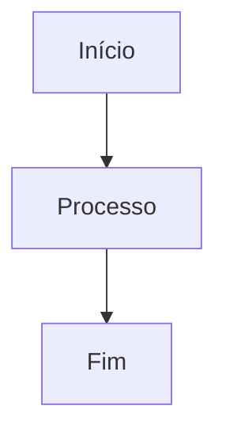

# MarkFlow Lite

> Um editor Markdown online de front-end puro

[](https://opensource.org/licenses/MIT)

<p align="center">
  <a href="README.md">中文</a> •
  <a href="README_en.md">English</a> •
  <a href="README_ja.md">日本語</a> •
  <a href="README_es.md">Español</a> •
  <a href="README_de.md">Deutsch</a>
</p>

MarkFlow Lite é um editor Markdown de front-end puro que funciona inteiramente no navegador, sem necessidade de servidor e pronto para usar, com suporte para edição em tempo real, pré-visualização dupla, salvamento local e compartilhamento de conteúdo.

## 🌟 Recursos

- ✍️ **Edição em tempo real** - Suporta sintaxe Markdown padrão (incluindo tabelas, blocos de código, listas, etc.)
- 👁️ **Pré-visualização em tempo real** - Veja enquanto escreve, com suporte para fórmulas matemáticas e renderização de fluxogramas
- 💾 **Armazenamento local** - Salva automaticamente rascunhos no armazenamento local do navegador
- 📄 **Exportação de arquivos** - Suporta exportação para formatos PDF, HTML, Markdown
- 📂 **Gerenciamento de arquivos** - Suporta criação de novos documentos e abertura de arquivos Markdown locais
- 🔗 **Compartilhamento de conteúdo** - Gera links únicos, conteúdo pode ser compartilhado via parâmetros de URL
- 🎨 **Troca de tema** - Fornece temas escuro/claro, adaptado a diferentes ambientes de leitura
- ⌨️ **Operações de atalho** - Suporta atalhos comuns (negrito, itálico, inserção de título, etc.)
- 📱 **Design responsivo** - Suporta desktop, tablet e acesso móvel

## 🚀 Início rápido

### Uso online

Visite [MarkFlow Lite](https://editor.currso.com) diretamente para começar a usar.

### Desenvolvimento local

```bash
# Clonar o projeto
git clone https://github.com/blankzsh/markflow-lite.git

# Entrar no diretório do projeto
cd markflow-lite

# Instalar dependências
npm install

# Iniciar o servidor de desenvolvimento
npm run dev

# Construir para produção
npm run build

# Pré-visualizar a construção de produção
npm run preview
```

## 🛠️ Stack tecnológica

- **Framework de desenvolvimento**: React + TypeScript + Vite
- **Análise de Markdown**: markdown-it
- **Destaque de código**: Highlight.js
- **Design de estilo**: Tailwind CSS + @tailwindcss/typography
- **Fórmulas matemáticas**: MathJax (via markdown-it-mathjax3)
- **Suporte a fluxogramas**: Mermaid
- **Ferramenta de construção**: Vite
- **Plataformas de deploy**: GitHub Pages / Vercel / Netlify

## 📖 Guia de uso

### Operações básicas

1. **Modo de edição** - Escreva conteúdo Markdown na área de edição esquerda
2. **Modo de pré-visualização** - Veja o efeito renderizado em tempo real
3. **Modo dividido** - Veja ambas as áreas de edição e pré-visualização simultaneamente

### Atalhos

- `Ctrl + B` - Negrito
- `Ctrl + I` - Itálico
- `Ctrl + K` - Inserir link

### Integração de armazenamento em nuvem

MarkFlow Lite suporta múltiplos backends de armazenamento em nuvem:

1. **AWS S3** - Conecte-se a buckets de armazenamento S3 para gerenciamento de arquivos
2. **WebDAV** - Conecte-se a qualquer servidor habilitado para WebDAV
3. **Armazenamento local** - Armazenamento local do navegador (padrão)

Através do explorador de arquivos, você pode:
- Conectar e desconectar serviços de armazenamento em nuvem
- Navegar estruturas de pastas remotas
- Criar, editar e excluir arquivos remotos
- Sincronizar arquivos locais e remotos

### Sintaxe suportada

- Cabeçalhos (#, ##, ###, ...)
- Estilos de texto (negrito, itálico, tachado)
- Listas (ordenadas, não ordenadas, listas de tarefas)
- Links e imagens
- Blocos de código e código inline
- Citações em bloco
- Tabelas
- Linhas horizontais
- Fórmulas matemáticas (LaTeX)
- Fluxogramas (Mermaid)

### Uso de fluxogramas Mermaid

Suporta múltiplos tipos de gráficos Mermaid:

```markdown

```

Tipos de gráficos suportados:
- Fluxogramas (Flowchart)
- Diagramas de sequência (Sequence Diagram)
- Diagramas de Gantt (Gantt Diagram)
- Diagramas de classe (Class Diagram)
- Diagramas de estado (State Diagram)

## 📤 Funções de exportação

- **Exportação PDF** - Exporta documentos para formato PDF
- **Exportação HTML** - Exporta para arquivos HTML independentes
- **Exportação Markdown** - Exporta arquivos Markdown originais

## 🐛 Problemas corrigidos

### Problemas recentemente corrigidos

- Corrigido o problema de renderização de fluxogramas muito grandes, otimizado o controle de tamanho dos gráficos
- Resolvido o problema de blocos de código sendo obscurecidos por tabelas
- Corrigido grandes espaços em branco que apareciam na parte inferior da página após a renderização de fluxogramas
- Otimizado a ordem de exibição correta de todo o conteúdo na mesma camada

## 🔧 Deploy

### Deploy no Vercel

```bash
npm run build
vercel --prod
```

### Deploy no Netlify

```bash
npm run build
# Upload do diretório dist para o Netlify
```

### Deploy no GitHub Pages

```bash
npm run build
# Push do diretório dist para a branch gh-pages
```

## 🤝 Contribuição

Bem-vindo para enviar Issues e Pull Requests para ajudar a melhorar o MarkFlow Lite.

### Processo de desenvolvimento

1. Faça fork do projeto
2. Crie uma branch de feature (`git checkout -b feature/AmazingFeature`)
3. Commit das mudanças (`git commit -m 'Add some AmazingFeature'`)
4. Push para a branch (`git push origin feature/AmazingFeature`)
5. Abra um Pull Request

## 📄 Licença

Este projeto está licenciado sob a Licença MIT - veja o arquivo [LICENSE](LICENSE) para detalhes

## 🙏 Agradecimentos

- [markdown-it](https://github.com/markdown-it/markdown-it) - Parser de Markdown
- [Highlight.js](https://highlightjs.org/) - Destaque de sintaxe de código
- [Tailwind CSS](https://tailwindcss.com/) - Framework CSS
- [MathJax](https://www.mathjax.org/) - Renderização de fórmulas matemáticas
- [Mermaid](https://mermaid-js.github.io/) - Renderização de fluxogramas
- [Vite](https://vitejs.dev/) - Ferramenta de build front-end

## 📞 Contato

URL do projeto: [https://github.com/blankzsh/markflow-lite](https://github.com/blankzsh/markflow-lite)

Se tiver dúvidas ou sugestões, por favor envie um Issue ou contate o mantenedor do projeto.